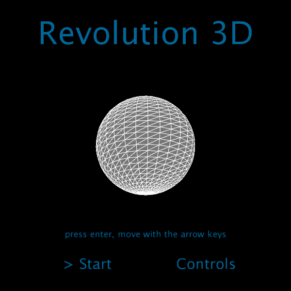

# Revolution 3D

## Autor
Miguel Ángel Medina Ramírez  
Correo: miguel.medina108@alu.ulpgc.es

## Indice
1. [Introducción](#introducción)
2. [Demostración](#demostración)
3. [Dependencias](#dependencias)
4. [Implementación](#implementación) 
 4.1. [Diseño de clases](#diseño-de-clases) 
 4.2. [Algoritmo de rotación](#algoritmo-de-rotación) 
 4.3. [Rotación](#rotación) 
5. [Eventos y Controles](#eventos-y-controles)
6. [Bibliografía](#bibliografía)

## Introducción
Esta práctica consiste en diseñar figuras 3D mediante una serie de puntos en dos dimensiones que simbolizan el perfil de las figuras a crear. Para ello se ha utilizado generación de mallas en triángulos mediante un algoritmo de rotación de los puntos iniciales. Asimismo, se ha añadido una serie de menús y controles de teclado para tener aspecto de aplicación.

## Demostración

  
  
Figura 1: Gif de muestra

## Dependencias
Para poder ejecutar y probar la práctica solamente se necesita clonar este repositorio y el editor de processing con la siguiente dependencia:
- La librería **GifAnimation** para poder reproducir y guardar gifs. Como esta librería no forma parte necesaria para la correcta implementación de la práctica, en el código toda la lógica relacionada con ella se encuentra comentada, además de que afecta al rendimiento de la aplicación.En este [enlace](https://github.com/extrapixel/gif-animation) se encuentra la forma de instalarla.

## Implementación

### Diseño de clases

### Algoritmo de rotación

### Rotación

## Eventos y Controles

## Bibliografía

* [Guion de prácticas](https://cv-aep.ulpgc.es/cv/ulpgctp20/pluginfile.php/126724/mod_resource/content/22/CIU_Pr_cticas.pdf)
* [processing.org](https://processing.org/)
* [Superficie de revolución](https://es.wikipedia.org/wiki/Superficie_de_revoluci%C3%B3n)

