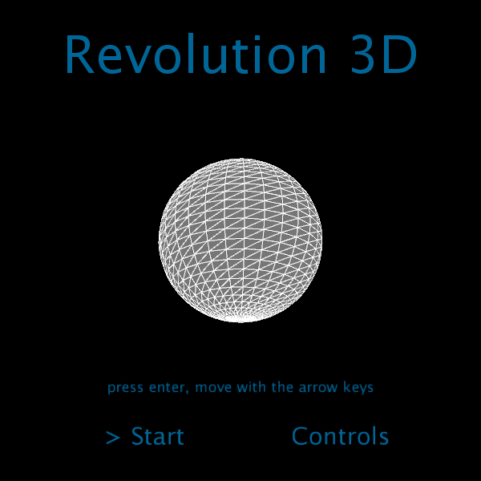
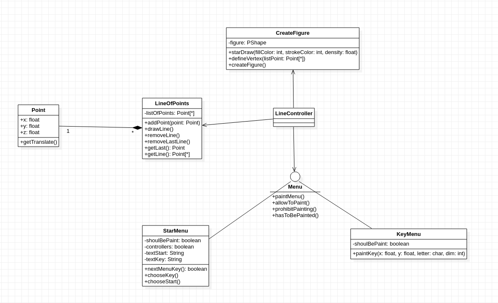
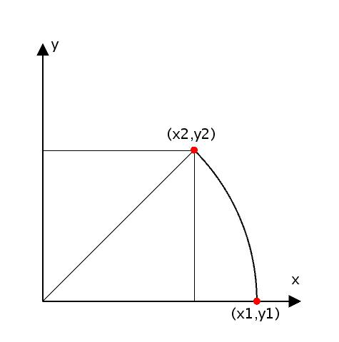
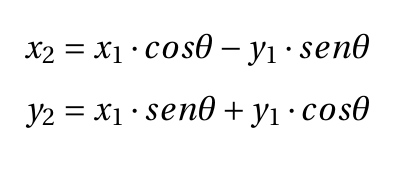
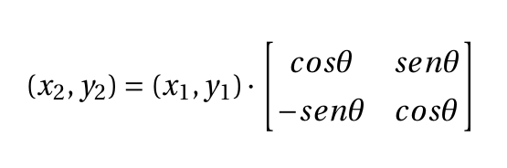
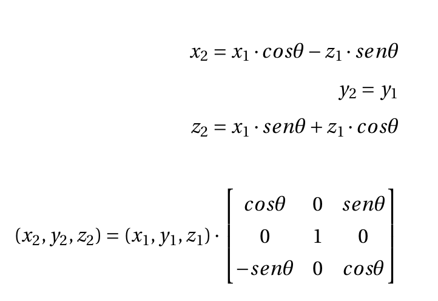

# Revolution 3D


## Autor
Miguel Ángel Medina Ramírez <br>
Correo: miguel.medina108@alu.ulpgc.es

## Índice
1. [Introducción](#introducción)
2. [Demostración](#demostración)
3. [Dependencias](#dependencias)
4. [Implementación](#implementación)<br>
 4.1. [Diseño de clases](#diseño-de-clases)<br>
 4.2. [Algoritmo de rotación](#algoritmo-de-rotación)<br>
 4.3. [Rotación](#rotación)<br>
5. [Eventos y Controles](#eventos-y-controles)
6. [Bibliografía](#bibliografía)

## Introducción
Esta práctica consiste en diseñar figuras 3D mediante una serie de puntos en dos dimensiones que simbolizan el perfil de las figuras a crear. Para ello se ha utilizado generación de mallas en triángulos, mediante un algoritmo de rotación de los puntos iniciales. Asimismo, se ha añadido una serie de menús y controles de teclado para tener aspecto de aplicación.


## Demostración
<p align="center"> 
   </img>
   <p align="center">Figura 1: Gif de demostración</p>
</p>

## Dependencias
Para poder ejecutar y probar la práctica solamente se necesita clonar este repositorio y el editor de processing con la siguiente dependencia:
- La librería **GifAnimation** para poder reproducir y guardar gifs. Como esta librería no forma parte necesaria para la correcta implementación de la práctica, en el código toda la lógica relacionada con ella se encuentra comentada, además de que afecta al rendimiento de la aplicación.En este [enlace](https://github.com/extrapixel/gif-animation) se encuentra la forma de instalarla.

## Implementación
Se ha optado por el patrón arquitectónico **MVC**

### Diseño de clases
<p align="center"> 
   </img>
   <p align="center">Figura 2: Diagrama de clases</p>
</p>

Donde la distribución de clase sería la siguiente:

<dl>
  <dt>Vistas</dt>
    <dd>Menu: interfaz común a todos los menu.</dd>
    <dd>StartMenu:menú de inicio.</dd>
    <dd>KeyMenu:El menú de información de los controles.</dd>
    <dd>CreateFigure:Crea la figura mediante puntos.</dd>
    <dd>LineOfPoints:Dibuja la línea de puntos.</dd>
  <dt>Modelo</dt>
    <dd>Point: implementa las coordenadas de un punto en el lienzo.</dd>
  <dt>Controladores</dt>
    <dd>LineController: para gestionar la aplicación.</dd>
</dl>


### Algoritmo de rotación
La creación de objetos 3D resulta engorrosa al ser necesario disponer de mecanismos para
definir los vértices que delimitan el objeto en un escenario tridimensional, y esto debe hacerse
sobre una pantalla bidimensional. Una posible simplificación del proceso viene dada a través
de la creación de un objeto por medio de superficies de barrido o revolución. En ambos casos,
se definen en primer lugar una serie de puntos, que conforman una línea poligonal que
bien puede aproximar una curva plana (generalmente), que bien por sucesivas traslaciones
(barrido) o rotaciones (revolución) permiten definir la malla de un objeto tridimensional.

En dos dimensiones la rotación de un punto sobre el plano cartesiano se ilustra de la siguiente manera:

<p align="center"> 
   </img>
   <p align="center">Figura 3: Ejemplo de rotación</p>
</p>

Siguiendo la regla de la mano derecha, al rotar un ángulo θ el punto p con
coordenadas (x1, y1), las coordenadas resultantes (x2, y2) tras la rotación se calculan de la siguiente forma:

<p align="center"> 
   </img>
</p>
<p align="center"> 
   </img>
</p>


Si lo llevamos a 3D:

<p align="center"> 
   </img>
</p>

Así pues su algoritmo consistirá en ir iterando sobre los puntos de dos en dos, y resolver el sistema de ecuaciones para los dos puntos.Además de ir creando los vértices correspondientes.

### Rotación

La implementación de la rotación se encuentra dentro de la clase *CreateFigure* que crea una figura *PShape* y define un mallado *beginShape(TRIANGLE_STRIP)*.  

Mediante el método *defineVertex* se van definiendo los vértices correspondientes y resolviendo el sistema de ecuaciones para una vuelta cartesiana completa, entre el ángulo 0 y el 2pi.

```java
 public void defineVertex(ArrayList<Point> listPoint){
    for(int index = 1; index < listPoint.size(); index++){
      Point point = listPoint.get(index-1).getTranslate(); 
      Point nextPoint = listPoint.get(index).getTranslate();
      figure.vertex(point.x,point.y,point.z);
      for(float angle = 0.0f; angle <= PI*2; angle += PI/4){
        float pointX = point.x*cos(angle) - point.z*sin(angle);
        float pointZ = point.x*sin(angle) + point.z*cos(angle);
        figure.vertex(pointX,point.y,pointZ);
        
        float nextPointX = nextPoint.x*cos(angle) - nextPoint.z*sin(angle);
        float nextPointZ = nextPoint.x*sin(angle) + nextPoint.z*cos(angle);
        figure.vertex(nextPointX,nextPoint.y,nextPointZ);
      }
      figure.vertex(nextPoint.x,nextPoint.y,nextPoint.z);
    }
  }
```

## Eventos y Controles

<table style="width:100%">
  <tr>
    <th>Tecla</th>
    <th>Uso</th>
  </tr>
  <tr>
    <td>w</td>
    <td>alejar figura</td>
  </tr>
  <tr>
    <td>s</td>
    <td>acercar figura</td>
  </tr>
  <tr>
    <td>f</td>
    <td>borrar ventana actual y figuras</td>
  </tr>
  <tr>
    <td>r</td>
    <td>borrar toda la línea de puntos</td>
  </tr>
  <tr>
    <td>l</td>
    <td>borrar el último punto</td>
  </tr>
  <tr>
    <td>c</td>
    <td>crear figura</td>
  </tr>
  <tr>
    <td>flecha Right</td>
    <td>Elegir start</td>
  </tr>
  <tr>
    <td>flecha Left</td>
    <td>Elegir control</td>
  </tr>
  <tr>
     <td>Enter</td>
     <td>Pulsar menu</td>
   </tr>
</table>

Se puede hacer uso de las ruedas del ratón para hacer zoom a la figura, además el ratón sirve también para rotarla. Los puntos se crean clicando con el ratón y moviéndolo, si se mantiene pulsado se puede ver la posible recta.

## Bibliografía

* [Guion de prácticas](https://cv-aep.ulpgc.es/cv/ulpgctp20/pluginfile.php/126724/mod_resource/content/22/CIU_Pr_cticas.pdf)
* [processing.org](https://processing.org/)
* [Superficie de revolución](https://es.wikipedia.org/wiki/Superficie_de_revoluci%C3%B3n)


